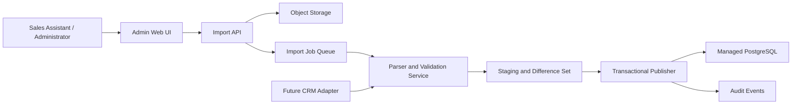

# Stage 2 Data Import and Central Persistence Design

**Status:** Approved
**Date:** 2026-07-11  
**Scope:** Central database, fixed-format Excel/CSV imports, Rate Card versioning, import administration, audit, and rollback

## 1. Purpose

Stage 2 replaces browser-local demo data with centrally managed business data. Sales assistants upload fixed-format Excel or CSV files through an administrative interface. The system validates each file as one atomic batch, shows a change preview, and publishes approved changes to PostgreSQL. Original files and generated reports remain in object storage for audit.

The ingestion boundary is intentionally reusable. A future CRM adapter will submit data through the same validation, mapping, publishing, and audit services rather than writing directly to business tables.

## 2. Scope Boundaries

### Included

- PostgreSQL as the central structured-data store, initially self-hosted on the production VPS behind a private container network.
- S3-compatible object storage for original files and generated reports.
- Independent imports for customer/brand/Sales PIC relationships, buildings, sales packages, and Rate Card versions.
- Fixed templates for `.xlsx` and `.csv` inputs.
- Lightweight background import jobs sized for approximately 5,000 rows per file and monthly updates.
- Full-batch validation, change preview, publication, import history, correction imports, and rollback.
- Draft, publication, activation, supersession, and rollback lifecycle for Rate Cards.
- Server-side permissions and immutable audit events.
- English and Simplified Chinese administrative UI, with English as the default.

### Excluded

- Direct editing of individual business records in the administrative UI.
- Live CRM synchronization; Stage 2 only establishes the adapter boundary.
- Final real-user and team administration, except for the user reference required by Sales PIC validation.
- Quotation PDF generation and document archive implementation.
- A mandatory two-person maker-checker rule. The permissions are separate, but the same user may hold both permissions initially.

## 3. Confirmed Business Decisions

| Area | Decision |
|---|---|
| Rate Card validity | A Rate Card has an effective date. When a new version becomes active, the prior active version is automatically superseded. |
| Import granularity | Customer/brand/Sales PIC relationships, buildings, sales-package master data, and Rate Cards are imported independently. Rate Card is always a distinct versioned import. |
| Package identity | Package code and name are stable master data. New packages receive new codes. Package membership and package price are versioned with the Rate Card. |
| Base-data updates | Imports use incremental upsert. Matching IDs are updated, new IDs are inserted, absent rows remain unchanged, and explicit `Inactive` status is required to deactivate data. |
| Identifiers | Building Code comes from the source data. Customer, Brand, Assignment, and Package identifiers are generated by the system on first import and included in later exports. Excel row numbers are never identifiers. |
| Validation failure | Any row error rejects the entire batch. Partial imports are not allowed. |
| Publication | Base data requires preview and confirmation. Rate Card requires a distinct Publish action. The uploader may also publish during the initial operating model. |
| Recovery | The system supports corrective imports and controlled rollback. Both paths retain complete audit history. |
| Original files | Original input files, validation reports, difference reports, and checksums are retained long-term in object storage. |
| Direct editing | Business data cannot be edited record-by-record. All changes come from imported files. |
| Scale | Building files are approximately 5,000 rows; other files are below 5,000 rows; updates occur approximately monthly. |

The historical quotation price-snapshot policy remains an input to the quotation/archive design. Stage 2 nevertheless treats published Rate Card versions as immutable so either eventual quotation policy remains supportable.

## 4. Architecture

### Components

1. **Admin Web UI** uploads files, shows job progress, renders validation errors and differences, and exposes publish/rollback actions according to server-side permission checks.
2. **Import API** verifies the authenticated user, validates upload metadata, stores the original file, calculates its checksum, and creates an import job.
3. **Object Storage** stores immutable original uploads, downloadable error reports, and difference reports. PostgreSQL stores only metadata and object references.
4. **Background Import Processor** parses files and runs schema, field, uniqueness, reference, and business-rule validation outside the upload request.
5. **Staging Layer** stores normalized candidate rows and a calculated difference set without changing active business data.
6. **Transactional Publisher** applies an approved difference set in one PostgreSQL transaction and creates audit events.
7. **CRM Adapter Boundary** maps future CRM records into the same normalized candidate-row contracts used by manual imports.

The application does not depend on a specific PostgreSQL or S3-compatible vendor. The confirmed initial production topology is one VPS: PostgreSQL and MinIO run on its private rootless-Docker network, the Next.js web process is reachable only through loopback and host-level Caddy, and encrypted backups are copied to separate S3-compatible storage outside the VPS. PostgreSQL and object storage can later move to managed services without changing application contracts or schema.

## 5. Core Data Model

### 5.1 Customer and Assignment Domain

- `customers`: internal ID, generated customer code, name, status, source metadata, timestamps.
- `brands`: internal ID, generated brand code, customer ID, name, status, source metadata, timestamps.
- `sales_assignments`: internal ID, generated assignment code, customer ID, brand ID, Sales PIC user ID, sales type, buying channel, client status, client type, registration date, expiry date, remarks, status, source metadata, timestamps.
- `users`: referenced by Sales PIC user ID. Full lifecycle and permission administration belongs to Stage 3.

One Brand belongs to one Customer. One Customer/Brand may have multiple assignment rows when another business attribute, such as Sales PIC or buying channel, differs. Exact duplicate input rows are rejected. After the initial import, Assignment ID is the update key.

### 5.2 Building and Package Domain

- `buildings`: internal ID, source Building Code, name, location/area, category, traffic, impressions, status, approved source attributes, timestamps.
- `sales_packages`: internal ID, generated Package Code, package name, status, timestamps.

Existing package codes are never reused. A package used by historical Rate Cards is deactivated rather than deleted.

### 5.3 Rate Card Domain

- `rate_card_versions`: internal ID, version code, effective date, currency (`IDR`), lifecycle status, uploader, publisher, upload/publish/activation timestamps.
- `rate_card_building_prices`: version ID, Building ID, price in IDR.
- `rate_card_package_configs`: version ID, Package ID, package price in IDR.
- `rate_card_package_buildings`: version ID, Package ID, Building ID.

Package identity is stable while package membership and package price are immutable version data. Published Rate Card rows are never updated in place.

### 5.4 Import and Audit Domain

- `import_jobs`: batch ID, data type, template version, checksum, lifecycle state, counts, source type, uploader, publisher, timestamps, failure summary.
- `import_files`: import job ID, object-storage key, original filename, MIME type, size, checksum, file purpose.
- `import_errors`: import job ID, sheet/file, row, column, stable error key, localized parameters.
- `import_changes`: import job ID, entity type/ID, change type, before value, after value.
- `audit_events`: actor, action, entity, entity ID, import job ID, reason, timestamp, before/after metadata.

Audit events and published import metadata cannot be deleted by ordinary administrators.

## 6. Identifier Strategy

- PostgreSQL uses immutable internal IDs for relationships.
- The system also generates stable, exportable business codes for Customer, Brand, Assignment, and Package records.
- Building Code is supplied by the approved building source file and remains unique.
- First-import rows may omit system-generated IDs. The parser groups consistent Customer and Brand names, rejects ambiguous conflicting definitions, and generates IDs only after full validation succeeds.
- Every later update template contains the generated IDs. Existing records are updated by ID, never by mutable name.
- Future CRM IDs are stored as external identifiers alongside internal IDs; they never replace internal primary keys.

## 7. Template Contracts

Every template includes a machine-readable template version. Unknown versions and missing required columns reject the batch before row validation.

### 7.1 Customer / Brand / Sales PIC

The fixed relationship template contains:

- Assignment ID (blank on initial import)
- Customer ID (blank on initial import)
- Customer Name
- Brand ID (blank on initial import)
- Brand Name
- Sales PIC Email or User ID
- Sales Type
- Buying Channel
- Client Status
- Client Type
- Registration Date
- Expired Date
- Remarks
- Status (`Active` or `Inactive`)

Sales PIC is matched by email or immutable system User ID, never by display name.

### 7.2 Buildings

The building template requires Building Code, Building Name, and Status. Location, category, traffic, impressions, and the final approved business attributes will be mapped from the final building source file before implementation begins. The parser contract is extended through an explicit template-version change rather than accepting arbitrary columns.

### 7.3 Sales Packages

The sales-package master template contains:

- Package Code (blank for a new package and generated by the system)
- Package Name
- Status (`Active` or `Inactive`)

A published package-master batch must create a package before a Rate Card can reference it. Rate Card imports never create or rename package master records implicitly.

### 7.4 Rate Card

An Excel Rate Card import is one atomic workbook with logical sections for:

- version metadata: version code, effective date, currency;
- building prices: Building Code and price;
- package prices: Package Code and price;
- package membership: Package Code and Building Code.

The final sheet names and column mapping will be derived from the approved Rate Card source document before parser implementation. CSV remains supported as a coordinated multi-file batch containing the same four logical datasets; all files pass or fail together.

## 8. Import Lifecycle

### Base Data

`Uploaded → Validating → Validation Failed | Ready to Publish → Published → Rolled Back`

### Rate Card

`Uploaded → Validating → Validation Failed | Draft → Published → Active → Superseded | Rolled Back`

- Upload returns an Import Job identifier without waiting for parsing.
- A browser refresh does not lose job progress.
- Validation produces a localized error report or a categorized difference preview: Added, Modified, Deactivated, Unchanged.
- Base-data publication requires confirmation by a user with the relevant import permission.
- Rate Card publication is a distinct action requiring `rate_card.publish`.
- Initially, the same sales assistant may upload and publish. The model records uploader and publisher separately so a future policy can enforce different users without a schema change.
- Effective dates are interpreted at midnight in `Asia/Jakarta`, stored as instants, and shown in the active locale.
- Activation of a new Rate Card atomically changes the previous Active version to Superseded.

## 9. Validation Rules

### File and Template

- Accept only `.xlsx` and `.csv` content matching the declared MIME type.
- Reject macro-enabled files and disguised file extensions.
- Enforce configured file-size and row-count limits.
- Require the approved template version, sheet/file names, and mandatory columns.

### Field and Identity

- Enforce required fields, types, date formats, enumerations, and `Active`/`Inactive` status.
- Require nonnegative finite IDR amounts.
- Reject duplicate Building Codes, generated IDs, and exact duplicate assignment rows.
- Reject conflicting first-import definitions for the same normalized Customer or Brand.

### References and Business Rules

- Sales PIC must reference an active system user.
- Brand must belong to the stated Customer.
- Building prices and package memberships must reference active buildings.
- Package configurations must reference valid package codes.
- Inactive buildings cannot be included in a new Rate Card package configuration.
- A Rate Card requires a unique version code, effective date, IDR currency, and a complete internally consistent dataset.
- Published Rate Cards cannot be overwritten.

Any validation error sets the whole import job to Validation Failed. The downloadable error report identifies sheet/file, row, field, localized error, and corrective guidance.

## 10. Publication, Idempotency, and Recovery

- A checksum identifies the exact uploaded file. A file already published for the same data type cannot be published again.
- Only one publication transaction per data type runs at a time.
- Publication rechecks the user's permission and the import job's latest state.
- PostgreSQL applies the entire difference set in one transaction.
- Corrective changes are normally delivered through a new import batch.
- Rollback creates compensating changes and audit events; it does not erase history.
- Direct base-data rollback is limited to the latest published batch for that data type unless dependency analysis proves later batches are unaffected.
- A blocked rollback returns the dependent batch or Rate Card identifiers and requires a corrective import instead.
- Rate Card rollback reactivates the prior valid version and records the reason, actor, and timestamp.

## 11. Admin Experience

### Dashboard

- active Rate Card and effective date;
- entity counts;
- processing and failed jobs;
- Rate Cards awaiting publication;
- recent publications and rollbacks.

### Import Center

- separate entry points for Customer/Brand/Sales PIC, Buildings, Sales Packages, and Rate Card;
- blank-template download and current-data export;
- file upload and persistent progress;
- validation errors and downloadable error report;
- categorized before/after difference preview;
- publication confirmation;
- immutable import history and file download.

### Rate Card Management

- Draft, Published/Waiting, Active, Superseded, and Rolled Back views;
- upload, compare, publish, rollback, and original-file download actions;
- no direct edit action for a published version.

## 12. Permissions

Stage 2 defines server-enforced permission points independently from roles:

- `data.import.customer_brand`
- `data.import.building`
- `data.import.package`
- `rate_card.upload`
- `rate_card.publish`
- `data.rollback`
- `data.audit.read`
- `data.file.download`

The initial two sales assistants may hold all relevant permissions. Stage 3 maps real users, teams, and roles onto these permission points. Enabling mandatory two-person Rate Card publication later is a policy change, not a data-model change.

## 13. Security and Operations

- Authenticate every administrative request and authorize every upload, publish, rollback, export, and download on the server.
- Generate storage keys server-side; never trust uploaded filenames as paths.
- Treat formulas as stored values or text; never execute spreadsheet formulas or macros on the server.
- Use parameterized database queries and transactional writes.
- Restrict original-file access to authorized users through short-lived downloads.
- Store database and object-storage credentials only in deployment secrets.
- Record actor, source, timestamp, reason, and before/after metadata for privileged actions.

## 14. Performance Targets

- Return an Import Job identifier within two seconds of completing the upload request.
- Validate and calculate differences for a typical 5,000-row file within 60 seconds under normal service load.
- Preserve job progress across page refreshes and reconnects.
- Keep all publication operations atomic and retry-safe.

The lightweight job design meets the expected monthly import frequency without introducing a full ETL platform or high-throughput message architecture.

## 15. Test Strategy

- Unit tests for Excel/CSV parsing, normalization, identifiers, validation keys, and difference calculation.
- Contract tests for every approved template version.
- Integration tests for PostgreSQL transactions, idempotency, publication, activation, supersession, correction imports, and rollback dependency checks.
- Authorization tests for every administrative permission point.
- Security tests for malformed files, disguised MIME types, formula/macro content, path manipulation, and unauthorized object access.
- Performance tests using representative 5,000-row building imports.
- End-to-end tests for upload, progress, error report, difference preview, publish, history, and rollback in English and Simplified Chinese.
- CRM adapter contract tests using the same normalized ingestion interface before live CRM integration begins.

## 16. Implementation Inputs

Parser implementation starts only after these source assets are supplied and approved:

1. the final customer/brand/Sales PIC workbook, including the Customer field currently outside the shared screenshot;
2. the final building workbook and authoritative list of business columns;
3. the final Rate Card workbook or equivalent source document;
4. the Stage 3 user list containing an immutable User ID or email for every valid Sales PIC;
5. permitted enum values for Sales Type, Buying Channel, Client Status, Client Type, and other controlled fields.

These assets finalize template mappings; they do not change the architecture, lifecycle, atomicity, identifier, audit, or permission decisions in this specification.
