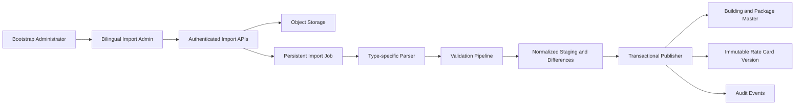

# Stage 2 Import Administration — First Vertical Slice

**Status:** Approved design and written specification
**Date:** 2026-07-18  
**Scope:** Bilingual import administration for Buildings, Sales Package Master, and Rate Card publication

## 1. Purpose

This first Stage 2 delivery creates a usable administrative import loop on the existing central PostgreSQL and object-storage foundation. A permitted administrator can download a fixed template, upload an Excel or CSV file, monitor validation, review errors and differences, publish the validated batch, and inspect publication history after a browser refresh.

The delivery covers three dependent datasets in this order:

1. Building Master;
2. Sales Package Master;
3. Rate Card, including standalone-building prices, package prices, and package-to-building membership.

Customer, Brand, and Sales PIC import remains outside this delivery until the final source template is provided. The administration interface shows that dataset as unavailable rather than accepting a provisional format.

This specification supersedes the Rate Card effective-date, activation, and lifecycle rules in `2026-07-11-stage-2-data-import-design.md`. Other compatible principles in the earlier design remain valid.

## 2. Confirmed Business Decisions

| Area | Decision |
|---|---|
| Building identity | IRIS Building ID is permanent, unique, non-reusable, and assigned before a new building enters a Rate Card. ERP Building ID is optional external mapping data. |
| Building updates | Imports use incremental upsert. Matching IRIS Building IDs are updated, new IDs are inserted, absent rows remain unchanged, and explicit inactive status is required to deactivate a building. |
| Package identity | Package code and name are stable master data. New packages receive new codes. Membership and price may change in each Rate Card publication. |
| Rate Card dates | Administrators do not provide `effective_from` or `effective_to`. Every manual publication becomes the current Rate Card immediately. |
| Rate Card history | Every publication creates an immutable system version. The current version is the most recently published successful version; older versions remain queryable for audit and future quotation snapshots. |
| Publication | Validation and difference preview must succeed before publication. Publication is atomic: all rows become current together or none do. |
| Input size | Building files are expected to contain about 5,000 rows; other files are smaller and are normally updated monthly. |
| Administration language | English is the default. Simplified Chinese is available throughout the import administration interface. |
| Quotation integration | This slice does not move the quotation wizard onto partially imported central data. The switch occurs only after all required master datasets and contracts are approved. |
| Deployment | This work is developed and verified locally. It does not update the existing Sites demo or VPS production until the user separately approves merge and deployment. |

## 3. Delivery Boundary

### Included

- bilingual administration shell and import dashboard;
- template download for the three included data types;
- `.xlsx` and `.csv` upload through existing object storage;
- persistent import job status and refresh-safe progress;
- full-batch parsing and validation;
- localized, downloadable validation-error reports;
- Added, Modified, Deactivated, and Unchanged difference preview;
- server-authorized publication;
- immutable import and Rate Card version history;
- current Rate Card summary;
- Building Master incremental publication;
- Sales Package Master incremental publication;
- Rate Card publication for standalone prices, package prices, and package membership;
- bootstrap administrator access until the final user/permission list is imported;
- automated tests for validation, publication, authorization, persistence, and expected file size.

### Excluded

- Customer, Brand, and Sales PIC import implementation;
- Brand Claim rules, which remain a CRM responsibility;
- live CRM or ERP API synchronization;
- direct row-by-row editing of imported business data;
- final Group A/B, Sales Manager, and team permission mapping;
- quotation-wizard migration from demo data to central data;
- VAT, target-total reverse calculation, and final IDR precision rules;
- quotation PDF generation and document archive;
- automatic deployment to Sites or VPS production.

## 4. Architecture

The existing import domain remains the shared framework. Dataset-specific modules provide template metadata, row normalization, validation, difference calculation, and publication behavior. UI components consume stable import-job and history APIs rather than depending on parser internals.

Each module has one clear responsibility:

- **Template contract:** defines versioned columns, data types, examples, and localized guidance.
- **Parser:** converts Excel or CSV values to a normalized candidate-row contract without writing active data.
- **Validator:** reports all detectable errors with sheet/file, row, field, stable error key, and localized parameters.
- **Difference builder:** compares normalized rows with the latest published master data.
- **Publisher:** performs authorization and applies the complete validated difference set in one transaction.
- **Admin UI:** presents status and permitted actions; it never substitutes for server-side authorization.

## 5. Administration Experience

### 5.1 Navigation and Locale

The administrative area is separate from the sales quotation workspace. It opens in English by default and provides an English / 简体中文 switch. The selected locale persists for subsequent admin pages on the same browser.

The navigation contains:

- Overview;
- Buildings;
- Sales Packages;
- Rate Cards;
- Customer / Brand / Sales PIC, displayed as **Waiting for final template** and not clickable for upload;
- Import History.

### 5.2 Overview

The overview shows:

- current published Rate Card system version and publication time;
- active and inactive Building counts;
- active and inactive Package counts;
- imports currently validating or ready to publish;
- failed imports requiring correction;
- recent publications.

### 5.3 Dataset Import Page

Each included dataset page follows the same workflow:

1. download the current template and field guide;
2. select or drag an `.xlsx` or `.csv` file;
3. upload and receive a durable Import Job ID;
4. watch validation progress, including after refresh;
5. view summary counts and row-level errors;
6. download the complete error report when validation fails;
7. review categorized differences when validation succeeds;
8. publish after explicit confirmation;
9. view the resulting publication and audit record.

No record-by-record edit control is provided. Corrections are made in the source file and uploaded as a new batch.

## 6. Template Contracts

All templates carry a machine-readable template version. Missing required columns, duplicate normalized headers, unknown template versions, unexpected worksheets in a single-workbook contract, and disguised file formats reject the batch before publication.

### 6.1 Building Master

Required fields:

- IRIS Building ID;
- Building Name;
- Operational Status (`Active` or `Inactive`).

Supported business fields:

- ERP Building ID, optional;
- Building Type;
- Grade Resource;
- Area;
- City;
- CBD Area;
- Sub-District;
- Address;
- Data Source.

IRIS Building ID is the update key and cannot be renamed. ERP linkage may be added or corrected without changing identity. The full identity and ERP reconciliation rules continue to follow `2026-07-11-building-identity-erp-mapping-design.md`.

### 6.2 Sales Package Master

Fields:

- Package Code;
- Package Name;
- Status (`Active` or `Inactive`).

An existing Package Code is the update key. Its stable identity is never reused. A new row may omit Package Code; after the entire batch passes validation, the system assigns a unique code and includes it in current-data export and publication results. Rate Card import never creates, renames, or reactivates a Package implicitly.

### 6.3 Rate Card

One Rate Card publication contains three logical datasets:

- standalone-building prices: IRIS Building ID and IDR price;
- package prices: Package Code and IDR price;
- package membership: Package Code and IRIS Building ID.

Excel uses one workbook with exactly three data worksheets: `Building Prices`, `Package Prices`, and `Package Membership`. CSV uses one file with `Record Type`, `IRIS Building ID`, `Package Code`, and `Price IDR` columns. `Record Type` is one of `BUILDING_PRICE`, `PACKAGE_PRICE`, or `PACKAGE_MEMBER`; fields that do not apply to that row type must be blank. The template contains examples for all three row types. There are no business-entered effective or expiry date fields.

The system generates a unique immutable version code at publication, using publication time plus a collision-safe sequence or identifier. The generated code, uploader, publisher, checksum, source file, row counts, and publication timestamp are retained.

## 7. Validation Rules

### 7.1 Common Validation

- accept only real `.xlsx` and `.csv` content matching allowed file signatures and MIME types;
- reject macro-enabled workbooks and executable or disguised content;
- enforce configured file-size, worksheet, and row-count limits;
- report empty required values, invalid enumerations, invalid number formats, and duplicate keys;
- normalize harmless whitespace without silently changing business identifiers;
- reject non-finite or negative IDR prices;
- reject the entire batch if any error exists;
- never change active data during parsing, validation, or preview.

### 7.2 Building Validation

- IRIS Building ID is required, unique in the file, and unique in master data;
- an existing IRIS Building ID cannot be replaced by another ID;
- an ERP Building ID, when provided, cannot be linked to two IRIS buildings;
- inactive status is explicit; omission from a monthly file does not deactivate a building.

### 7.3 Package Validation

- Package Code is unique when supplied;
- new code generation occurs only after full-batch validation;
- Package Name is required;
- historical Package Codes are never reused;
- deactivation is explicit and cannot erase historical Rate Card references.

### 7.4 Rate Card Validation

- every standalone price references an active Building;
- every package price references an active Package;
- every membership row references an active Package and active Building;
- duplicate standalone prices, duplicate package prices, and duplicate membership pairs are rejected;
- a package used in the Rate Card must have one package price and at least one member Building;
- inactive or unknown references reject the entire Rate Card;
- one exact uploaded checksum cannot be published twice for the same data type;
- a published Rate Card version is never overwritten.

## 8. Difference Preview

The preview is calculated against the latest successfully published state and stored with the Import Job.

For Building and Package Master it categorizes:

- **Added:** new business identifier;
- **Modified:** existing identifier with changed business fields;
- **Deactivated:** explicit transition from Active to Inactive;
- **Unchanged:** identical normalized record.

Absent Building or Package rows are not shown as deactivated. For Rate Card, the preview compares the candidate version with the current version and summarizes added, removed, or changed standalone prices, package prices, and membership pairs. “Removed” here describes the new Rate Card version’s composition; it does not delete rows from historical versions.

## 9. Publication and Current-Version Rules

Publication requires a fresh server-side permission check and a validated, unchanged Import Job. A client-hidden button is never treated as authorization.

### Building and Package Master

- publication applies all Added, Modified, and Deactivated records in one PostgreSQL transaction;
- system-generated Package Codes are assigned inside that transaction;
- failure rolls back the complete batch;
- successful publication records actor, time, import job, checksum, and before/after summary.

### Rate Card

- publication creates new immutable version rows and all associated prices and memberships in one transaction;
- the new version becomes `Current` immediately after the transaction commits;
- the previous `Current` version becomes `Historical` in the same transaction;
- no scheduler or effective-date comparison is involved;
- a failed transaction leaves the prior current version unchanged;
- historical versions and their source files remain available for audit and future quotation snapshots.

Only one publication per dataset type may commit at a time. The publisher rechecks that the preview was built against the expected current version; if another publication won the race, the stale job must be revalidated before it can publish.

## 10. Permissions and Bootstrap Access

The first slice reuses server-side authentication and permission checks already present in the application. It introduces or reuses granular permissions for:

- viewing import administration;
- uploading each included dataset;
- viewing validation details and source files;
- publishing Building and Package Master;
- publishing Rate Cards;
- viewing immutable history and audit metadata.

Until the real user and Group A/B mapping arrives, an explicitly configured bootstrap administrator receives these import permissions. The bootstrap mechanism is environment-controlled, auditable, and removable without changing data contracts. It does not grant quotation approval authority and does not hardcode Ayu, April, Thomas, team, or Group A/B routing into the import system.

## 11. Persistence, Files, and Audit

- the original upload is stored immutably in object storage;
- PostgreSQL stores the Import Job, checksum, template version, normalized staging rows or durable staging references, errors, differences, publication record, and audit events;
- browser refresh obtains job status from the server and does not restart processing;
- error reports and publication results are downloadable through authorized, time-limited access;
- published history is not deletable by ordinary administrators;
- the optional off-site backup policy remains separate from this feature and does not block the internal-demo import workflow.

## 12. Error Handling

- Upload errors return a stable localized error code and do not create a publishable job.
- Parser or validator failures set the job to `Validation Failed` and preserve the source file and complete error report.
- Unexpected processor failures set the job to `Processing Failed`, record a safe diagnostic identifier, and expose a retry only when retry cannot duplicate publication.
- A stale difference preview sets the job back to validation-required instead of publishing against changed master data.
- Transaction failures publish nothing and keep the previous current data intact.
- Unauthorized requests return a server-side denial even if manually constructed outside the UI.
- UI messages provide corrective guidance without exposing secrets, storage credentials, SQL details, or server paths.

## 13. Testing and Acceptance Criteria

### Automated Coverage

- parser and template-contract unit tests for Excel and CSV;
- validation tests for missing fields, duplicate IRIS IDs, duplicate Package Codes, invalid prices, and inactive or unknown references;
- difference tests for Added, Modified, Deactivated, Unchanged, and Rate Card membership changes;
- transaction tests proving all-or-nothing publication;
- concurrency tests proving stale previews cannot overwrite a newer publication;
- authorization tests for view, upload, publish, file download, and history APIs;
- persistence tests proving refresh-safe job state;
- localization tests for English default and Simplified Chinese messages;
- a representative 5,000-row Building import performance test;
- integration tests proving the newest successful Rate Card is Current and earlier versions remain Historical;
- browser smoke tests for template download, upload, error display, preview, confirmation, publication, history, and locale switching.

### Acceptance Criteria

The slice is complete when:

1. an authorized bootstrap administrator can complete the full Building → Package → Rate Card flow in English and Simplified Chinese;
2. a representative 5,000-row Building file validates and reaches preview within 60 seconds in the CI reference environment without losing job state on refresh;
3. any invalid row blocks the whole batch and appears in a downloadable error report;
4. explicit inactive status is required for Building or Package deactivation;
5. Rate Card publication requires no effective or expiry date;
6. a successfully published Rate Card immediately becomes Current;
7. the prior Rate Card remains immutable and queryable as Historical;
8. a concurrent or failed publication cannot partially change current data;
9. unauthorized users cannot upload, publish, download protected files, or inspect import history;
10. Customer / Brand / Sales PIC visibly remains unavailable pending its final template;
11. the existing quotation demo continues using its complete demo dataset until a later approved migration;
12. no Sites or VPS deployment occurs as an implicit side effect of local implementation.

## 14. Later Integration

After the final Customer / Brand / Sales PIC template and user permission mapping are approved, those datasets will be added through the same template, validation, difference, publication, and audit framework. Only after the complete master-data set is available will a separate specification migrate the quotation wizard from demo data to centrally published data.

Future CRM and ERP adapters must submit the same normalized contracts and pass the same validation rules. They must not write directly to published master or Rate Card tables.
